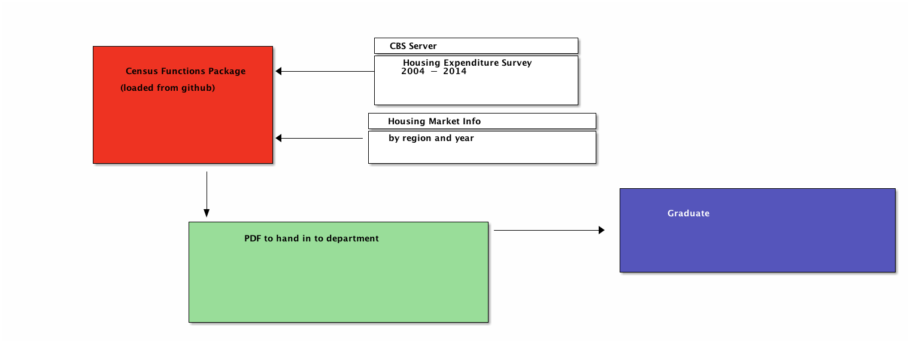

```{r setup, include=FALSE}
knitr::opts_chunk$set(echo = FALSE, cache=TRUE, messages=FALSE, warning=FALSE)
#source("./includes/updatePackage.R",  echo=FALSE)
#source("./includes/getHousePrices.R", echo=FALSE)
#source("./includes/importPrices.R",   echo=FALSE)
#source("./includes/getGDP.R",         echo=FALSE)
#source("./includes/graphGDPhouseholdConsumption.R",echo=FALSE)
#source("./includes/groupHouseSize.R",echo=FALSE)
```

\begin{abstract}
Uses pseudo-panel construction to calculate the housing wealth effect for regional cohorts of Isreali households. Combines data from the Central Bureau of Statistics Household Expenditure Survey and the Consumer Price Index.
\end{abstract}

\begin{keywords}
 consumption, economics, housing, housing market, liquidity constraints, wealth effect 
\end{keywords}

\newpage

#Introduction
## The housing market

## Consumption by Households
# Literature Review
## the housing wealth effect                          
# Structure of the project

